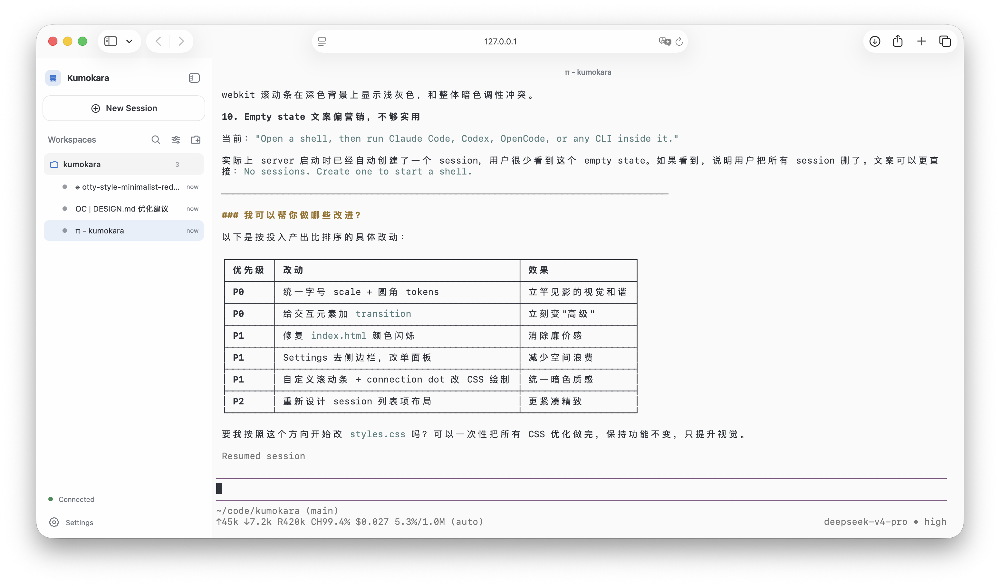

# Kumokara（雲殻）

> Persistent, agent-neutral shells in the browser.

Kumokara is a self-hosted terminal for long-running coding agents. Its product
model is deliberately small: the left side organizes sessions by workspace and
the right side is a shell. Start Claude Code, Codex, OpenCode, or any other CLI
inside the shell; Kumokara stays agent-neutral and keeps the terminal as the
primary interface.



## Product model

- **Workspace navigation** — browser-local workspaces organize sessions by directory.
- **Session runtime** — each terminal session remains an independent server-owned PTY.
- **Implicit project context** — a session's current working directory is its workspace context.
- **Agent neutral** — every CLI works through the generic PTY path.
- **Progressive awareness** — known agent processes are detected automatically;
  adapters and hooks can add richer state later.
- **Browser-independent runtime** — closing or reconnecting the browser does not
  terminate a running shell.

Current known-agent discovery supports Claude Code, Codex, OpenCode, Kimi Code,
and Mimo Code on macOS and Linux. Unknown tools remain fully usable as ordinary
terminal processes.

## Quick start

Prerequisites:

- Rust stable (the repository toolchain installs `rust-analyzer` automatically)
- Node.js 20+

```bash
git clone https://github.com/suxiaogang223/kumokara.git
cd kumokara
cd web && npm install && npm run build && cd ..
cargo run
```

Kumokara starts without authentication for local development and creates a shell
in the server's launch directory automatically. Start whichever agent you want
from that terminal; use **New Session** when you need another session in the
active workspace.

Open **Settings** at the bottom of the workspace sidebar to choose `System`,
`Light`, or `Dark`, select separate light and dark color themes, and change the
terminal font family or size. Settings are stored in the current browser.
Kumokara keeps a portable system monospace stack by default; if a prompt such as
Oh My Posh uses Nerd Font icons, install a Nerd Font and enter its exact family
name in Settings.

For a remote host:

```bash
kumokara server --bind 0.0.0.0:9876 --require-token
```

Put TLS or a trusted reverse proxy in front of an internet-facing deployment.
`--require-token` prints a random token and requires it as the first WebSocket
message. Never expose the default no-auth mode to an untrusted network.

## Architecture

```text
Browser attachments
        │ WebSocket
        ▼
SessionRegistry (single runtime source of truth)
        ├── SessionInfo (cwd + optional detected agent)
        ├── AgentAdapterRegistry (built-ins + registered plugins)
        ├── PtySession (server-owned PTY)
        ├── bounded sequenced output history
        └── live output broadcast
```

The browser can detach and later attach again. Attach first replays retained
chunks, then switches to the live broadcast stream without a replay/live race.
Each attachment fits its own xterm viewport locally. After the focused browser
settles at a new grid size, it sends one active resize so a full-screen TUI can
redraw to that window before the user types again. Background pages never send
`SIGWINCH`; input still carries the foreground grid atomically as a final guard,
while output bytes continue to be broadcast to every attachment.

Tab titles follow a layered terminal-title model: standard OSC 0/2 titles from
the running program win, OSC 26 `SessionTitle` is the agent-aware hint, then the
registered adapter display name and cwd provide fallbacks. OSC 26 also carries
agent status and detail without scraping terminal text.

Workspace navigation is browser-local: it stores directory paths and view
preferences without introducing a second server runtime model. The server
protocol still treats the session and its canonical working directory as the
source of truth; there is not yet a server-synchronized Workspace lifecycle or
Workspace API.

The Rust workspace contains six focused crates:

- `kumokara-protocol`: client/server wire types;
- `kumokara-agent`: public adapter trait, registry, and built-in providers;
- `kumokara-engine`: one concrete `PtySession` owning the child process, PTY I/O,
  and ordered input/resize commands;
- `kumokara-auth`: token generation and validation;
- `kumokara-server`: session runtime and HTTP/WebSocket boundary;
- `kumokara-cli`: local and daemon entry points.

## Current boundaries

- Browser disconnect/reconnect is supported. The server-owned PTY and bounded
  output history remain alive while the Kumokara service is running.
- Restarting the Kumokara service ends its PTY sessions. Long-lived Agent
  context is resumed through each Agent's own persisted session mechanism.
- Process-based agent discovery is best-effort. Provider hooks will add approval,
  task, and resume metadata without becoming a launch requirement.
- Output replay is bounded raw terminal history, not yet a server-side terminal
  screen emulator.
- SSH targets, OAuth, notifications, and multi-user isolation are not implemented.

See [DESIGN.md](DESIGN.md) for the current design and implementation boundaries.

## Development

```bash
cargo fmt --all -- --check
cargo clippy --workspace -- -D warnings
cargo test --workspace
cd web && npm run build
```

## License

MIT © Kumokara Contributors
